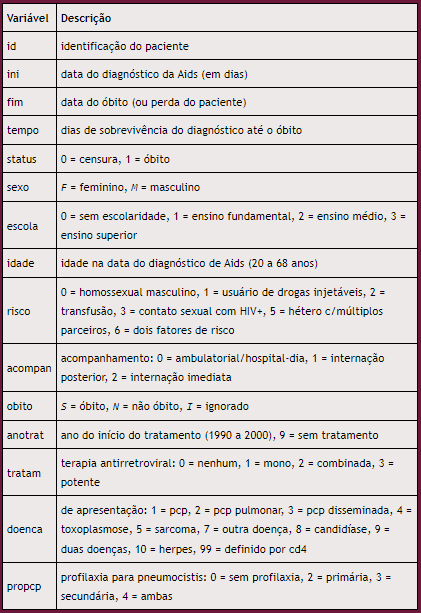

```{r setup, include=FALSE}
library(knitr)
library(rmdformats)
library(tidyverse)
library(survival)
opts_chunk$set(echo = FALSE,
	             cache = FALSE,
               prompt = FALSE,
               tidy = FALSE,
               comment = NA,
               message = FALSE,
               warning = FALSE)
```

# **Introdução**

Os dados são provenientes de coortes hospitalares de pacientes portadores de HIV. A primeira coorte é constituída dos pacientes portadores de HIV atendidos entre 1986 e 2000 no Instituto de Pesquisa Clínica Evandro Chagas (Ipec/Fiocruz). Dessa coorte, obteve-se uma amostra de 193 indivíduos que foram diagnosticados como portadores de Aids (critério CDC 1993) durante o período de acompanhamento.

# **Dicionário de variáveis**

<center>




</center>

# **Leitura dos dados**

```{r }
ipec<-read.table("dados/ipec.csv",header=T,sep=";")
```


Visualizando o banco de dados:

```{r echo=FALSE}
ipec |> 
  DT::datatable()
```

<br>

a. No formato clássico:

```{r echo=FALSE}
# Criando a variável resposta da análise de sobrevivência,
# combinando as informações de tempo e status 
suv_class <- Surv(ipec$tempo, ipec$status);suv_class

```

b. No formato de processo de contagem:

```{r echo=FALSE}
suv_cont <- Surv(ipec$ini, ipec$fim, ipec$status);suv_cont
```
